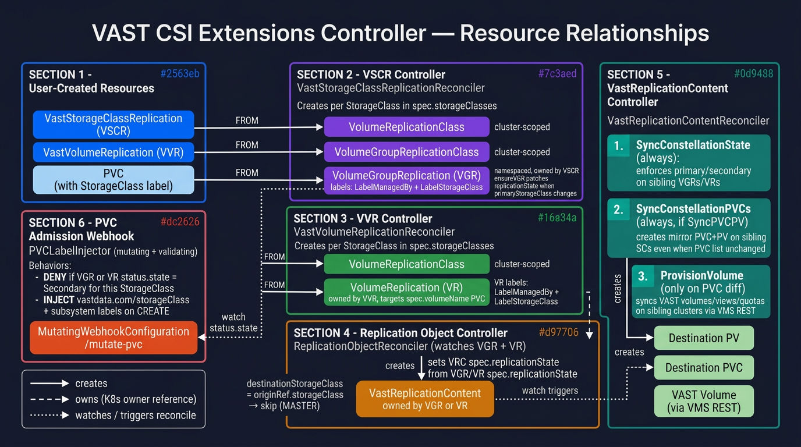

# VAST CSI Extensions Controller — Developer Guide

The extensions controller is a Kubernetes operator that manages cross-cluster
**replication** for VAST Data storage.  It bridges the
[csi-addons](https://github.com/csi-addons/kubernetes-csi-addons) replication
primitives (`VolumeReplication`, `VolumeGroupReplication`) with the VAST VMS
REST API so that volume replication state, mirror PVCs/PVs, and VAST backend
objects (volumes, views, quotas) are all kept in sync automatically.

---

## Table of Contents

1. [Architecture overview](#architecture-overview)
2. [Custom Resource Definitions](#custom-resource-definitions)
3. [Controllers](#controllers)
   - [VSCR Controller](#1-vscr-controller-vaststorageclassreplicationreconciler)
   - [VVR Controller](#2-vvr-controller-vastvolumereplicationreconciler)
   - [Replication Object Controller](#3-replication-object-controller-replicationobjectreconciler)
   - [VastReplicationContent Controller](#4-vastreplicationcontent-controller-vastreplicationcontentreconciler)
4. [Provisioner layer](#provisioner-layer)
5. [PVC Admission Webhook](#pvc-admission-webhook)
6. [CLI — `vcsi`](#cli--vcsi)
7. [Key labels and annotations](#key-labels-and-annotations)
8. [Error handling and retries](#error-handling-and-retries)
9. [Development guide](#development-guide)

---

## Architecture overview



The diagram shows six logical sections:

| # | Section | Kubernetes reconciler / component |
|---|---------|-----------------------------------|
| 1 | **User-created resources** | `VastStorageClassReplication`, `VastVolumeReplication`, PVCs |
| 2 | **VSCR Controller** | `VastStorageClassReplicationReconciler` |
| 3 | **VVR Controller** | `VastVolumeReplicationReconciler` |
| 4 | **Replication Object Controller** | `ReplicationObjectReconciler` |
| 5 | **VastReplicationContent Controller** | `VastReplicationContentReconciler` |
| 6 | **PVC Admission Webhook** | `PVCLabelInjector` |

A single binary (`extensions-manager`) runs all four controllers and the
webhook server in the same process.  Each controller is single-worker and
uses a `KeyLocker` to serialise concurrent reconcile requests for the same
object.

---

## Custom Resource Definitions

### `VastStorageClassReplication` (VSCR)

The top-level user-facing CRD for **group** replication (all PVCs for a set of
StorageClasses).

```yaml
spec:
  primaryStorageClass: vastdata-site-a          # which SC is currently primary
  protectionTopology:                           # bidirectional mesh of SC pairs
    - source: vastdata-site-a
      destination: vastdata-site-b
      peerName: clusterA-clusterB-peer          # VAST replication peer name
  protectionPolicyTemplate:                     # schedule for VAST protection policies
    # Time units: s/S=seconds, m=minutes, h/H=hours, d/D=days, w/W=weeks, M=months(30d), y/Y=years
    frames:
      - every: 15m
        keepLocal: 2d
        keepRemote: 1w
  syncIntervalSeconds: 900
  syncPVCPV: true          # create mirror PVC+PV on each secondary SC
  pvcs: [myapp-data-1, myapp-data-2]
  action: ungracefulFailover
```

`spec.protectionTopology` defines the full n-cluster mesh.  For two clusters
one entry suffices; for three you need three entries (A–B, A–C, B–C), and so on.
The full list of StorageClasses is derived from the topology entries — no
explicit list is needed.

### `VastVolumeReplication` (VVR)

Per-volume replication CRD.  Similar spec to VSCR but targets a single PVC
(`spec.volumeName`) rather than a group.

### `VastReplicationContent` (VRC)

**Internal CRD — do not create manually.**  Created one-per-StorageClass by
the Replication Object Controller.  Carries all information needed by the
VastReplicationContent Controller in its spec:

| Field | Meaning |
|-------|---------|
| `spec.storageClass` | Which StorageClass this VRC manages |
| `spec.provisionerType` | `Block` or `File` |
| `spec.replicationState` | `primary` or `secondary` |
| `spec.pvcs` | Current desired PVC list (managed PVCs excluded by VRC controller) |
| `spec.protectedPathName` | VAST ppath name (populated after first reconcile) |
| `spec.replicationPath` | VAST target exported dir |
| `spec.protectionPolicyName` | VAST protection policy name |
| `spec.syncPVCPV` | Always `true` for VVR (mirror PVCs required for csi-addons); inherited from parent VSCR |
| `status.pvcs` | PVC list as of last successful provision |
| `status.provisioned` | True once first provision succeeded |

`spec.protectedPathName`, `spec.replicationPath`, and
`spec.protectionPolicyName` are **immutable once written** — the controller
preserves existing values to prevent clearing them on partial reconciles.

---

## Controllers

### 1. VSCR Controller (`VastStorageClassReplicationReconciler`)

**File:** `internal/controller/vaststorageclassreplication_controller.go`

**Watches:** `VastStorageClassReplication` (all changes), owned
`VolumeGroupReplication` (deletion only via predicate).

**Reconcile flow:**

```
1. Build one VMS REST client per StorageClass (cached).
2. Resolve missing peerName fields in protectionTopology via live peer discovery.
   → spec update → re-triggers reconcile with complete topology.
3. Predict ppathDir from the primary StorageClass (once, stored in status.ppathDir).
4. DiscoverLinkPolicies: ensure one VAST protection policy per topology edge.
5. EnsureConstellationPpath: create/verify the shared VAST protected path.
   → if ppath not yet active → RequeueAfter(20s)
6. For each StorageClass → ensureVGR(scName, ppathName)
```

`ensureVGR` creates or retrieves the `VolumeGroupReplication` for that SC and
**immediately patches `spec.replicationState`** when it differs from the
desired state (primary for `primaryStorageClass`, secondary for all others).
This is the authoritative state setter — no other component should set VGR
`spec.replicationState` directly.

VGRs carry two labels that enable label-based lookup:
- `app.kubernetes.io/managed-by: vast-extensions-controller`
- `vastdata.com/storageClass: <scName>`

### 2. VVR Controller (`VastVolumeReplicationReconciler`)

**File:** `internal/controller/vastvolumereplication_controller.go`

**Watches:** `VastVolumeReplication` (all changes), owned `VolumeReplication`
(deletion only).

Structurally identical to the VSCR Controller but operates on individual PVCs
via `VolumeReplication` rather than groups.  Creates one `VolumeReplicationClass`
and one `VolumeReplication` per StorageClass in `spec.protectionTopology`.

VRs carry:
- `app.kubernetes.io/managed-by: vast-extensions-controller`
- `vastdata.com/storageClass: <scName>`

### 3. Replication Object Controller (`ReplicationObjectReconciler`)

**File:** `internal/controller/replication_object_controller.go`

**Watches:** `VolumeGroupReplication` and `VolumeReplication` objects (managed
ones, filtered by `LabelManagedBy`).  A shared queue uses name prefixes
(`vgr/` or `vr/`) to route events to the correct reconcile path.

**Purpose:** Bridge from csi-addons objects → `VastReplicationContent`.

**Reconcile flow:**

```
1. Look up the parent VSCR or VVR from the VGR/VR's owner reference.
2. Build a VastReplicationContent spec from the VGR/VR fields:
   - storageClass     → from the parent VSCR/VVR topology
   - replicationState → desiredStateStr(vgr.Spec.ReplicationState)
                        (uses spec, not status, so propagation is immediate)
   - pvcs             → from VSCR.spec.pvcs
   - protectedPathName, replicationPath, protectionPolicyName → from VSCR status
3. Preserve existing ppath metadata from an existing VRC to prevent
   inadvertent clearing when ppathName is not yet in VSCR status.
4. EnsureOrUpdateVastReplicationContent → create or patch VRC
5. If this VGR/VR belongs to the primary SC → skip (it is the MASTER;
   the VRC controller on the secondary side manages the actual work).
```

**Predicates:**  Reconcile is triggered when `spec.replicationState` changes OR
`status.state` changes on a VGR/VR.  This ensures the VRC is updated
immediately when the VSCR Controller patches the VGR's desired state, without
waiting for csi-addons to confirm the observed state.

### 4. VastReplicationContent Controller (`VastReplicationContentReconciler`)

**File:** `internal/controller/vastreplicationcontent_controller.go`

**Watches:** `VastReplicationContent` (all changes).

This is the most complex controller.  It runs on every VRC and executes three
sequential phases on every reconcile:

```
Phase 1 — SyncKubernetesResources (always)
  Calls provisioner.SyncKubernetesResources(ctx)
  → skips immediately if this VRC is not primary
  → if primary and VAST ppath is in Source role:
      patch all sibling VGR/VR spec.replicationState to correct values
      patch the csi-addons internal VR directly (avoids csi-addons propagation delay)
      patch all sibling VRC spec.replicationState

Phase 2 — PVC diff check
  specSource  = spec.pvcs  filtered to exclude managed (mirror) PVCs
  statusSource = status.pvcs filtered to exclude managed PVCs
  toCreate = specSource − statusSource
  toDelete = statusSource − specSource
  → if no diff AND Phase 1 had no error → return nil (no-op)

Phase 3 — ProvisionVolume (only when diff is non-empty)
  Calls provisioner.ProvisionVolume(ctx, specSource, toDelete)
  → for each sibling VRC, instantiate a REST client for the sibling's
    StorageClass and ensure/delete VAST objects there
  → on success: recordProvisionMeta updates status.pvcs and status.provisioned
```

**Managed PVC filtering** (`filterManagedPVCs`): A PVC is *managed* if it
carries `app.kubernetes.io/managed-by: vast-extensions-controller`.  Managed
PVCs are excluded from the diff so that mirror PVCs created by `SyncSiblingPVCs`
never drive VAST provisioning decisions.

**`SyncSiblingPVCs`** (called from `ProvisionVolume` when `SyncPVCPV` is
enabled): for each sibling VRC, creates a static PV+PVC pointing at the same
underlying VAST volume but bound to the sibling's StorageClass.  These mirror
PVCs are what csi-addons VGR uses to track volumes on the secondary cluster.

---

## Provisioner layer

**Package:** `internal/provisioner/`

The provisioner layer is decoupled from the controllers via the `Interface`:

```go
type Interface interface {
    SyncKubernetesResources(ctx context.Context) error
    ProvisionVolume(ctx context.Context, toEnsure, toDelete PVCList) error
    CleanVolume(ctx context.Context) error
}
```

`NewProvisioner` dispatches on `VastReplicationContent.Spec.ProvisionerType`:

| Type | Provisioner | VAST objects managed |
|------|-------------|----------------------|
| `Block` | `BlockProvisioner` | NVMe-oF Volumes |
| `File` | `FileProvisioner` | Views + Quotas |

### `baseProvisioner`

Embedded by both concrete provisioners.  Holds:
- `sourceRest` — pre-initialised VAST REST client for the **source** SC
- `sourceSc` — source StorageClass, cached alongside `sourceRest`
- `ppath` — lazily populated VAST ProtectedPath details

VAST object provisioning (called via `ProvisionStep` interface) iterates over sibling
VRCs, instantiates a REST client per sibling via `vmsrest.NewFromVastReplicationContent`,
and calls `ensureBlockVastVolume` / `ensureFileVastObjects` for each PVC.

### `syncConstellation` / `SyncKubernetesResources`

`syncConstellation` is the primary/secondary enforcement engine.  It runs only
when:
1. `rp.Spec.ReplicationState == "primary"`
2. The VAST ppath on `sourceRest` reports `role == "source"`

It looks up the master VGR/VR by name from a label on the VRC, then walks the
entire constellation (master + all managed siblings) and writes the correct
`spec.replicationState` to each VGR/VR and VRC.  For VGRs it also directly
patches the csi-addons internal VR (`VGR.Spec.VolumeReplicationName`) to
trigger the VAST promote/demote operation without waiting for csi-addons to
propagate the VGR state change.

### Error types

| Type | Behaviour |
|------|-----------|
| `DeferredError` | Aggregates multiple errors; any `RetryAfterError` inside is promoted |
| `RetryAfterError` | Sets `ctrl.Result.RequeueAfter` for transient conditions |

`RetryAfterError` is returned (with a 10 s delay) when a PVC is not yet bound
to a PV — the VAST volume exists on the source but the Kubernetes side hasn't
caught up yet.

---

## PVC Admission Webhook

**File:** `internal/webhook/pvc_label_webhook.go`  
**Path:** `/mutate-pvc`  
**Type:** Mutating (can also deny)

`PVCLabelInjector.Handle` runs on every PVC CREATE for StorageClasses whose
provisioner matches `config.CSIDriverName`.

**Execution order:**

```
1. Decode PVC.
2. Fetch StorageClass info (provisioner, subsystem parameter) — cached per SC name.
3. CSI driver filter: skip if provisioner ≠ config.CSIDriverName.
4. Mirror PVC guard: if pvc.labels["app.kubernetes.io/managed-by"] = "vast-extensions-controller"
   → skip replication check (mirror PVCs are intentionally created on secondary clusters).
5. Replication state check (checkReplicationState):
   → list VolumeGroupReplications in pvc.Namespace with
       LabelManagedBy + LabelStorageClass = scName
   → list VolumeReplications in pvc.Namespace with same selector
   → if any has status.state = "Secondary" → DENY with message
6. Label injection (only if SC name / PVC name filters match):
   → add vastdata.com/storageClass: <scName>
   → add vastdata.com/subsystem: <subsystem>   (if set in SC parameters)
```

The check is **fail-open**: errors in listing VGR/VR return `Allowed` so that
a temporary API-server blip never blocks PVC creation.  Change
`failurePolicy: Ignore → Fail` in the `MutatingWebhookConfiguration` for
stricter guarantees.

---

## CLI — `vcsi`

**Package:** `internal/cmd/cli/`  
**Actions:** `internal/cmd/cli/actions/`  
**Binary entrypoint:** `cmd/main.go`

The same Go binary serves two purposes depending on the executable name:

| Binary name | Mode | Purpose |
|-------------|------|---------|
| `manager` | Operator | Starts all controllers + webhook server inside Kubernetes |
| anything else (e.g. `vcsi`) | CLI | Interactive user-facing tool; no controller-runtime manager |

The dispatch happens in `internal/cmd/root.go`:

```go
func NewCommand(name string) *cobra.Command {
    if name == "manager" {
        return newOperatorCommand(name)
    }
    return newCLICommand(name)
}
```

### Global flags

These flags are available on every CLI subcommand:

| Flag | Default | Description |
|------|---------|-------------|
| `--kubeconfig` | `~/.kube/config` | Path to kubeconfig file |
| `--kubecontext` | current context | Kubernetes context to use |
| `-n`, `--namespace` | `default` | Namespace for the target object |
| `--no-color` | `false` | Disable colored terminal output |

### `vcsi status`

**File:** `internal/cmd/cli/actions/status.go`

Display the full spec and status of a `VastStorageClassReplication` or
`VastVolumeReplication` in human-readable form.

```
vcsi status --vscr <name> [-n <namespace>]
vcsi status --vvr  <name> [-n <namespace>]
```

**Output includes:**

- Storage Classes in the topology
- Primary StorageClass (highlighted green)
- Current `spec.action` (colour-coded: yellow for failover, cyan for resync)
- Topology edges with peer names
- `syncIntervalSeconds`, `syncPVCPV`, `pvcRemap`
- Protection policy template (prefix + schedule frames)
- Status section: current primary, `ppathName`, `ppathDir`, last executed action

**Example:**

```
VastStorageClassReplication  default/app-replication
────────────────────────────────────────────────────────────
  Storage Classes:             ["vastdata-site-a", "vastdata-site-b"]
  Primary StorageClass:        vastdata-site-a
  Action:                      ungracefulFailover
  Topology:                    2 cluster(s), 1 target(s)
    vastdata-site-a → vastdata-site-b  (peer: clusterA-clusterB)
  Sync Interval:               900s
  PVC Remap:                   false
  Sync PVC/PV:                 true
  Sync VAST Objects:           true
  Protection Policy:
    Prefix:                    repl
    Frame[0]:                  every=15m keepLocal=2d keepRemote=1w

  Status:
  Current Primary:             vastdata-site-a
  Ppath Name:                  repl-app-replication
  Ppath Dir:                   /source/foo/bar
```

---

### `vcsi failover`

**File:** `internal/cmd/cli/actions/failover.go`

Switch the primary StorageClass on a VSCR or VVR.  `--primary` is required.
`--manner` is optional; when provided it additionally sets `spec.action`.

```
vcsi failover --vscr <name> --primary <sc> [--manner graceful|ungraceful] [-n <namespace>]
vcsi failover --vvr  <name> --primary <sc> [--manner graceful|ungraceful] [-n <namespace>]
```

| Flag | Required | Description |
|------|----------|-------------|
| `--vscr` | one of | Name of the VastStorageClassReplication |
| `--vvr` | one of | Name of the VastVolumeReplication |
| `--primary` | yes | Target primary StorageClass after failover |
| `--manner` | no | `graceful` → sets `spec.action = gracefulFailover`; `ungraceful` → `ungracefulFailover` |

**Validation performed before any patch:**

1. Exactly one of `--vscr` / `--vvr` must be given.
2. `--primary` must be a StorageClass that exists in the object's
   `protectionTopology`.  If not, the command errors with a list of valid candidates.
3. If `--primary` already equals the current `spec.primaryStorageClass` →
   see the "already primary" smart path below.

**What gets patched** (`internal/cmd/cli/client.go → PatchAction`):
- `spec.primaryStorageClass` is set to `--primary`
- `spec.action` is set when `--manner` is provided (otherwise unchanged)

**"Already primary" smart path:**

When the requested `--primary` is already the current `spec.primaryStorageClass`
the command does not immediately error.  Instead it checks whether the
downstream `VolumeGroupReplication` (for VSCR) or `VolumeReplication` (for VVR)
already reflects the desired primary state:

```
1. Look up VolumeGroupReplication named "<vscrName>-<scName>"
2. If VGR.Spec.ReplicationState == "primary"
   → error: "already in sync, nothing to do"
3. Otherwise (VGR absent or spec not yet primary):
   → Print warning about out-of-sync state
   → If --manner was given, also patch spec.action
   → Touch annotation vastdata.com/force-reconcile = <RFC3339 timestamp> on the VSCR
     to bump its resourceVersion and trigger a fresh reconcile loop
   → Print confirmation
```

This recovers from the case where the VSCR spec was already updated (e.g. from
a previous CLI call) but the controller never re-ran to propagate the change to
the VGR.

---

### `vcsi sync`

**File:** `internal/cmd/cli/actions/sync.go`

Request an immediate resync of a replication object.  Sets `spec.action = resync`
without changing the primary StorageClass.

```
vcsi sync --vscr <name> [-n <namespace>]
vcsi sync --vvr  <name> [-n <namespace>]
```

The controller picks up the action change on its next reconcile and forwards
`ActionResync` to the csi-addons VGR/VR, which triggers a VAST
re-synchronisation cycle.

---

### Internal CLI packages

| Package | Responsibility |
|---------|---------------|
| `internal/cmd/cli/` | Color helpers (`Green`, `Yellow`, `Cyan`, `Bold`); `PatchAction`, `ForceReconcileVSCR`, `ForceReconcileVVR` |
| `internal/cmd/cli/actions/` | One file per subcommand (`failover.go`, `status.go`, `sync.go`) |
| `internal/cmd/manager/` | `CLIManager` — lazy K8s client construction from `--kubeconfig`/`--kubecontext`; `Manager` interface shared between CLI and operator |

`ForceReconcileVSCR` / `ForceReconcileVVR` patch the
`vastdata.com/force-reconcile` annotation to a current RFC3339 timestamp.  This
is a lightweight "touch" that bumps the object's `resourceVersion` without
changing any spec fields, causing the VSCR/VVR controller to enqueue a new
reconcile request.

---

## Key labels and annotations

| Key | Set on | Value | Purpose |
|-----|--------|-------|---------|
| `app.kubernetes.io/managed-by` | VGR, VR, PVC, PV | `vast-extensions-controller` | Identifies resources managed by this operator |
| `vastdata.com/storageClass` | VGR, VR, PVC, PV | SC name | Enables label-based lookup by StorageClass |
| `vastdata.com/subsystem` | PVC | NVMe subsystem name | Label injection by webhook |
| `vastdata.com/source-vscr` | VRC | VSCR name | Links VRC to its parent VSCR |
| `vastdata.com/source-vvr` | VRC | VVR name | Links VRC to its parent VVR |
| `vastdata.com/source-volume-group-replication` | VRC | VGR name | Links VRC to its parent VGR |
| `vastdata.com/source-volume-replication` | VRC | VR name | Links VRC to its parent VR |
| `vastdata.com/constellation-owner` | mirror PVC/PV | VRC name | Scopes orphan cleanup per VRC |
| `vastdata.com/force-reconcile` | VSCR, VVR | RFC3339 timestamp | Touched by CLI to trigger reconcile without spec change |

---

## Error handling and retries

The controller-runtime reconcile loop requeues on any non-nil error.
`RetryAfterError` lets specific transient conditions set an explicit requeue
delay:

```go
// PVC not yet bound — retry after 10 s
return provisioner.NewRetryAfterError(fmt.Errorf("PVC %s not bound to a PV", pvcName), 10*time.Second)
```

`DeferredError` accumulates per-sibling errors during a constellation pass so
that one failing sibling doesn't skip the others.  Any embedded
`RetryAfterError` is surfaced as the overall result.

---

## Development guide

### Prerequisites

- Go 1.25+
- `kubectl` with access to a cluster running `csi-addons` and VAST CSI driver
- `make` (optional; most tasks are plain `go` commands)

### Build

```bash
cd extensions-controller
go build ./...                        # compile all packages
go build -o bin/vcsi ./cmd/main.go    # build the CLI binary
```

### Run locally (against a remote cluster)

```bash
# Start the operator pointing at your kubeconfig context
./bin/vcsi pvc-label-webhook --kubeconfig ~/.kube/config
```

### Project layout

```
extensions-controller/
├── api/v1alpha1/               # CRD Go types (VSCR, VVR, VRC)
├── cmd/main.go                 # CLI entrypoint (cobra root)
├── config/
│   ├── crd/                    # CRD YAML manifests
│   └── webhook/                # MutatingWebhookConfiguration
├── docs/                       # Developer diagrams
├── internal/
│   ├── cmd/
│   │   ├── cli/actions/        # vcsi subcommands (failover, status, sync)
│   │   └── webhook/            # pvc-label-webhook cobra command
│   ├── common/
│   │   ├── config/             # Config struct + env binding
│   │   ├── events/             # Event reason constants + BoundReporter
│   │   ├── k8s_client/         # K8sClient wrapper (typed API calls)
│   │   ├── ppathdir/           # PPath source-dir prediction
│   │   └── vmsrest/            # VAST VMS REST client construction + discovery
│   ├── controller/             # Reconcilers (VSCR, VVR, ReplicationObj, VRC)
│   ├── provisioner/            # Block + File provisioners, constellation sync
│   └── webhook/                # PVC admission handler
└── README.md
```

### Adding a new controller

1. Create `internal/controller/<name>_controller.go` with a `Reconcile` method.
2. Embed `BaseReconciler` for shared dependencies (`K8sClient`, `Log`, `Config`, `EventReporter`, `Locker`).
3. Register via `Setup<Name>Controller(mgr, k8sClient, logger, cfg)` — follow the pattern in existing controllers.
4. Call `Setup<Name>Controller` from `internal/cmd/webhook/webhook.go`.

### Running tests

```bash
go test ./...
```

Integration tests in `internal/controller/` use `envtest` (controller-runtime's
in-process API server).  Set `KUBEBUILDER_ASSETS` to the path of the
`envtest` binaries if they are not on `$PATH`.
